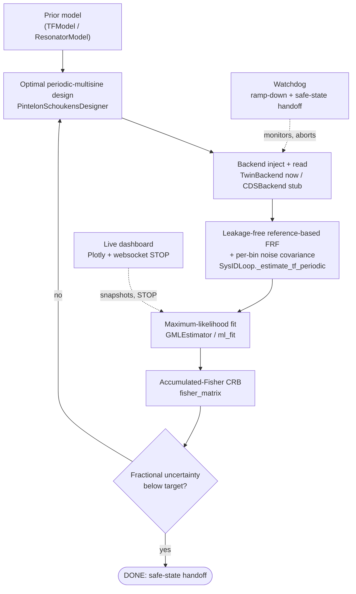

[](https://github.com/CaltechExperimentalGravity/system_ident/actions/workflows/ci.yml)

# system_ident

Real-time, optimal-excitation system identification for LIGO suspensions
(3-DoF: POS / Pitch / Yaw), built as a single Pintelon–Schoukens (P&S) pipeline,
with a digital-twin backend and a live operational dashboard.

`system_ident` runs iterative, optimal-excitation identification of a resonant
suspension plant as one clean P&S loop: an optimally designed **periodic
multisine** is injected, the plant is measured by a **leakage-free,
reference-based synchronous-DFT** frequency-response estimate carrying a per-bin
noise covariance, and a Gaussian **maximum-likelihood** fit refines the model
toward the Cramér–Rao bound. A digital-twin backend and a (stubbed) CDS-hardware
backend share one channel API, so simulation and hardware are interchangeable; a
physical-safety watchdog performs a safe-state handoff on any stop; and an
optional websocket dashboard renders the measurement as it converges.

## Architecture

The loop is closed: each pass measures the plant, refits the model, accumulates
Fisher information, and — until the fractional parameter uncertainty drops below
target — feeds the refined model back into the optimal designer so the next
excitation concentrates power where it buys the most information.



The first pass designs a *prior-robust* excitation from the prior model and its
(large) error bars — power spread over the plausible resonance band `f0*(1±u)`
so a far prior still covers the true resonance; later passes use the now-trusted
model for point-optimal excitation. Because every pass is an independent
measurement of the same LTI system on a fixed frequency grid, passes are combined
by inverse-variance weighting per bin (`SysIDLoop._accumulate`) and the model is
refit on the accumulated estimate — keeping the first pass's band coverage while
folding in each optimal pass's resonance-sharpening information.

## Codemap

| Module / subpackage | Responsibility |
| --- | --- |
| `model.TFModel` | Canonical SISO `H(s) = num/den` model — the shared parameterisation (`eval`, `jacobian`, `params`, `with_params`) every estimator, designer, and Fisher routine speaks. |
| `resonator.ResonatorModel` | Physical product-of-resonances model in `(f0, Q, gain)`; its `dH/df0` gradient relocates a peak away from the prior. `to_tf()` converts to `TFModel`. |
| `fisher` | Fisher information matrix, parameter covariance, and the P&S **dispersion** function — the engine behind both optimal design and the convergence/DONE criterion. |
| `excitation.multisine_from_psd` | Builds the injectable **periodic Schroeder-phase multisine** realising a designed PSD (leakage-free, low crest factor). `timeseries_from_asd` is the legacy coloured-noise drive. |
| `design/pintelon.PintelonSchoukensDesigner` | The optimal input designer: dispersion-function fixed-point iteration that reallocates drive power to the most informative bins under a fixed budget. |
| `estimators/gml.GMLEstimator` | The **only** estimator (`gml` / `ml`): a Sanathanan–Koerner `invfreqs` linearisation for a start, then exact-objective ML polish. |
| `estimators/bayesian` | Model-agnostic ML primitives: `ml_fit` (Gauss-Newton + Levenberg–Marquardt to the CRB) and `gn_normal_equations`. |
| `estimators/invfreqs` | Weighted inverse-frequency LS fit — survives only as the SK linearisation step inside `GMLEstimator` (not a standalone estimator). |
| `loop.SysIDLoop` | The orchestration loop: design → inject/read → safety-check → leakage-free FRF (`_estimate_tf_periodic`) → ML fit → inverse-variance accumulate → accumulated-Fisher convergence → repeat; emits dashboard snapshots. |
| `backends/base.ChannelBackend` | The inject / read / ramp-down + snapshot/restore interface that makes twin and hardware interchangeable. |
| `backends/twin.TwinBackend` | Digital twin: filters the drive through the discretised plant plus sensor/disturbance noise. Supports **MIMO cross-coupling**, **closed-loop controllers**, transport delay, and actuator saturation. |
| `backends/cds.CDSBackend` | Real-hardware backend (awg inject + nds2 readback) — **stub** raising `NotImplementedError`; lazy-imports the CDS libraries. |
| `plant.SuspensionPlant` | A named set of per-DoF `TFModel`s + sample rate, built from a `(f0, Q)` resonance spec; what the twin drives. |
| `safety.Watchdog` | Physical-limit watchdog (actuator saturation, output-RMS ceiling) owning the one shared, idempotent ramp-down + safe-state handoff. |
| `config.RunConfig` | Loads/validates the run YAML and builds the concrete plant, backend, priors, estimator, designer, and watchdog the loop needs. |
| `cli` | The `system_ident` CLI — YAML base + flag overrides + a confirm-before-inject guard; the primary way to drive a run. |
| `dashboard` | Dependency-free pub/sub `SnapshotHub` plus a lazily-built FastAPI/websocket server serving the live Plotly UI with the STOP button. |
| `export/foton` | Foton filter-file export of the fitted plant — **stub** raising `NotImplementedError`. |

## Documentation

Full docs (pedagogy, API reference, and executed worked examples) are built with
Quarto and published by CI to GitHub Pages. Build them locally with:

```bash
pip install -e ".[docs]"
(cd docs && quartodoc build) && quarto render docs   # output in docs/_site
```

## Install

```bash
pip install -e .          # core (twin path)
pip install -e .[dev]     # + pytest
pip install -e .[dashboard]   # + fastapi/uvicorn/websockets for the live UI
```

Core deps: numpy, scipy, control, pyyaml, matplotlib.

## Test

```bash
pytest
```

A handful of tests validate the ported math **bit-for-bit** against the original
`sysIDlib` engine, used as an oracle. The single reference file
`sys_id_dev/sysIDlib.py` is included so they run out of the box; if you remove
it, those tests `skip` (the rest of the suite is fully standalone).

## Run the digital-twin demo

```bash
system_ident run src/system_ident/configs/twin_demo.yml --twin --yes
# -> DONE (target reached), per-DoF fractional uncertainty below target
```

With the dashboard extra installed, drop `--yes` and a live Plotly view
(transfer function, coherence, designed excitation) is served locally with a
STOP button that triggers the safe-state handoff.

## Status

Implemented and tested: model / Fisher / excitation, the resonant plant, the
digital-twin backend (now with MIMO coupling + closed-loop controllers), the
maximum-likelihood (`gml`) estimator, the P&S periodic-multisine measurement and
optimal-excitation design, the orchestration loop (with cross-pass measurement
accumulation and accumulated-Fisher convergence), the safety watchdog + handoff,
config + CLI, and the dashboard core.

Not yet done: the CDS hardware backend (`backends/cds.py` — needs the LIGO CDS
`nds2`/awg libraries and hardware) and Foton export (`export/foton.py`) are
stubs that raise `NotImplementedError`.
